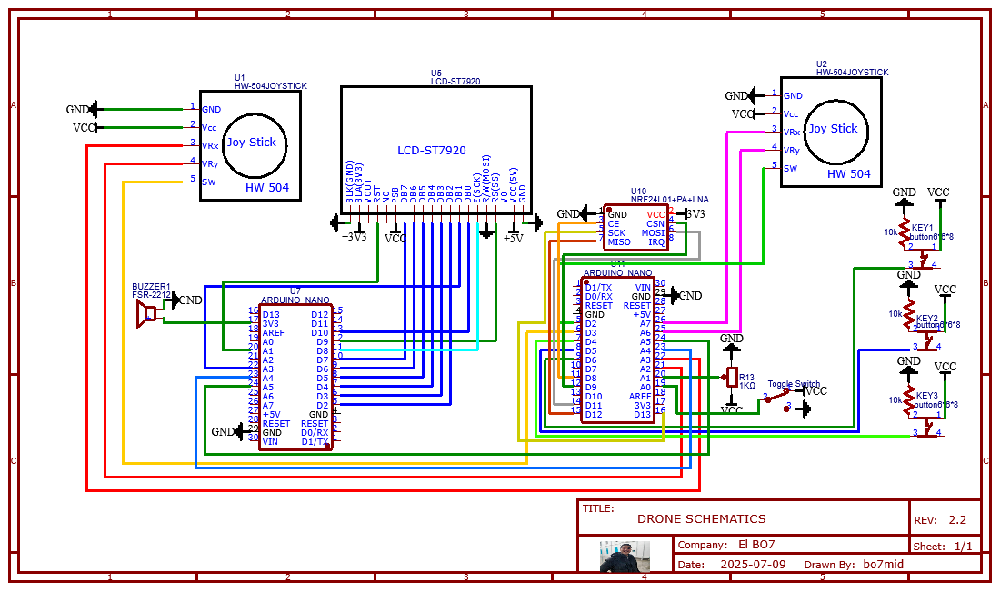
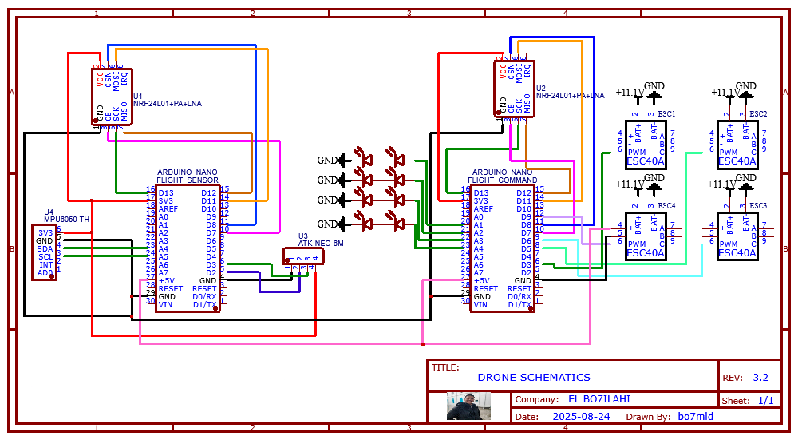
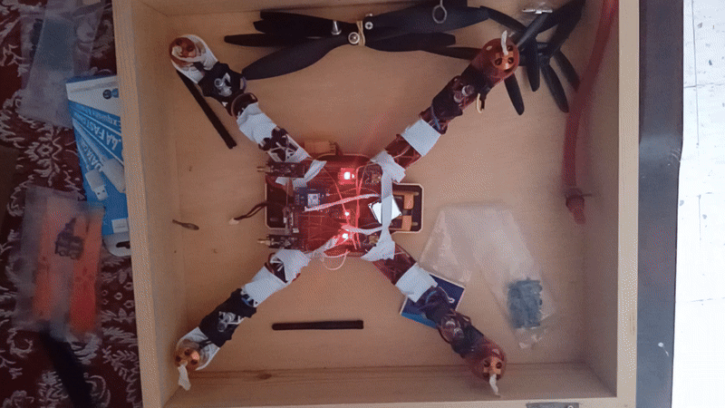

<h1 align="center">MagoFly</h1>
<p align="center">
  
  
</p>
<h2 align="center">MagoFly: a basic drone project</h2>

## ✨ What's MagoFly?
MagoFly is a drone capable of doing basic manoeuvres which is **controlled** by a **remote controller wirelessly** using **nRF24L01+ radio module**.

## 🎨 Features
- ✅ Remote telemetry on LCD

- ✅ Emergency landing + engine cut safety

- ✅ GPS-based altitude display

- ✅ Live telemetry on LCD


## 🚀 Quickstart

### 💻 Installation
> Arduino IDE is required for easy installation
- What we need:

| Module           | Why We need it                                                                              | Qte                                                                     |
|------------------|------------------------------------------------------------------------------------|----------------------------------------------------------------------------------|
| Arduino nano     | the brain of the whole operations                                                           | 4 Each Nano handles a dedicated subsystem (LCD, controller inputs, flight sensors, flight commands).                                             |
| nRF24L01+        | radio communication                                                                         | 3                                                                       |
| DJI450 FlameWheel| drone frame                                                                                 | 1                                                                       |
| MPU6050          | inertial measurment unit to get the accelerometer data                                      | 1                                                                       |
| LED              | (white)  light the drone when its dark                                                      | 8                                                                       |
| BLDC motors      | to provide enough lift to fly and manoevre the drone                                        | 4                                                                       |
| ESC              | (40A)  control the BLDC motors                                                              | 4                                                                       |
| NEO-6M GPS       | telemetry/coordonation data                                                                 | 1                                                                       |
| ESP32-CAM        | to see from above                                                                           | 1                                                                       |
| LiPo Battery     | power the drone (preferably a high C rating for longer flight time)                         | 1                                                                       |
| LCD display      |(st7920 IC) to show to reading on the RC                                                     | 1                                                                       |
| Joystick         |control the movements and the throttle of the drone                                          | 2                                                                       |
| Push buttons     |change the handmode for lefties and righties/enable lights / enable altitude control         | 3                                                                       |
| Toggle switch    | cut off engines                                                                             | 1                                                                       |
| Buzzer           | make asound everytime the altitude control or the buttons are pushed                        | 1                                                                       |
| Potentiometer    | determin max altitude                                                                       | 1                                                                       |
| Resistors        |(10k ohms) to link with the bush buttons between VCC & GND pins so the RC don't short circuit| 3                                                                       |
| Jumper wires     |  connect every thing                                                                        | ****LOT****      (>50)                                                  |
| soldering board  | soldering everything on it                                                                  | 2                                                                       |
| zip ties         | hold everything to its proper place                                                         | 6                                                                       |

- How to connect all the components:
  ### RC wiring


### Drone wiring

  - Fix the polarity of each motors so the rotation direction of each motor matches the fellowing picture:
     
  - solder each of them on a seperate soldering board.
  - change the SSID and the PASSWORD on the [`camera script`](camera/CameraWebServer/CameraWebServer.ino) to your wifi' ssid and password:
  ```c
  //change these if needed
  const char *ssid = "elbo7's" ;
  const char *password = "NiggaNigga";
  ```
- Upload the code to each board:
  - upload [`lcd screen script`](controller_lcd/controller_lcd.ino) to the arduino nano controlling the LCD screen.
  - upload [`rc controller script`](controller_cmds/controller_cmds.ino) to the arduino nano controlling the remote controller.
  - upload [`flight sensors script`](flight_sensors/flight_sensors.ino) to the arduino nano controlling the MPU6050 and NEO-6M.
  - upload [`flight command script`](flight_cmds/flight_cmds.ino) to the arduino nano controlling the BLDC motors.
- ****🚁 Take off!****

### 🛠️ Be cautious
- When labeling the BLDC motors in a clockwise direction: **1st** and **3rd**motors are spinning **Counter ClockWise**, **2nd** and **4th** spinning **ClockWise**.
- The drone **doesn't have** a **protocol** for when it **loses connection** with the RC. **In other words, it will hold the last inputs until it regain connection or motors keep spinning until battery dies**.
- **Emergency Landing** and **CutOffEngine** are **irreversible**. After these actions are engaged, disconnect the battery then reconnect it again if you want to fly the drone(**THIS WAS A SAFETY DESIGN**).
- ❌ The Drone is uncapable of doing diagonal movements. **So DO NOT move the joysticks is cross patterns!**
- ❌ No failsafe when RC disconnects

## 🚀 It's Flight Time
Follow these procedures:
- 1st: Power on the RC and **WAIT** for the animation to finish.
  
- 2nd: Connect the battery connector and wait for the lights to flash.
  
- 3rd: On the RC, click on the blue button (the toggle light) to see if there is a solid connection between thedrone and the RC.
- 4th: If the lights turned on, FLY! If not, get some distance between the RC and the Drone then try again. If that also fails, check the radio modules and see if the drone gets the sent data. If that fails, disconnect the battery and repeat from step 2.

## 🎮 About the remote
>- The left hand mode, the left joystick controls the **PITCH** and **ROLL** movements and the button enable/disable throttle change. You can know if the throttle is disables when you see horizontal line 
under the "THR" on the screen. While the right joystick controls the **THROTTLE** and **YAW** movements and the buttons toggle the meregency landing.
>/>
>- The right hand mode, the right joystick controls the **PITCH** and **ROLL** movements and the button enable/disable throttle change. You can know if the throttle is disables when you see horizontal line 
under the "THR" on the screen. While the left joystick controls the **THROTTLE** and **YAW** movements and the buttons toggle the meregency landing.
>/>
